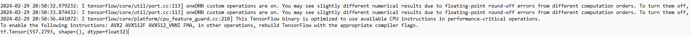

# ia
ia singkatan dari iteung-ai(artificial intelligence)

-------------------------------------------------------------------------------
# ITeung AI
Indonesia ChatBot using Seq2Seq (LSTM and BiLSTM) with Bahdanau Attention Mechanism

# Environment
Python: 3.7.9\
CUDA Toolkit: 11.0.3 [CUDA Toolkit Archive](https://developer.nvidia.com/cuda-toolkit-archive)\
CuDNN: v8.0.5 [CuDNN Archive](https://developer.nvidia.com/rdp/cudnn-archive)

# Usage
1. Install all required depedency
```console
$ pip install -r requirements.txt
```

2. run preprocessing.py
```console
$ python preprocessing.py
```

3. run training.py
```console
$ python training.py
```
4. check output_dir get 4 file from there to iteung-ai plus daftar-slang from dataset.
----------------------------------------------------------------------------------
# Kelas
## Pengenalan Kecerdasan Buatan
Teori Menjelaskan:
> Definisi Kecerdasan buatan
> Training
> Accuracy
> Data Preparasi 


# Python
Pengenaan Python
Kerjakan :
Pahami bagaimana instalasi python
Pahami bagaimana menggunakan python di cmd atau terminal
Pahami kegunaan pip
Pahami kegunaan file requirements.txt di python
Pahami sintaks dasar python

# Dataframe Pandas untuk preparasi
Pengenalan Dataframe Pandas
Penggunaan file CSV dengan Pandas

# Tesnsorflow
Kerjakan:
1. Cara instalasi tensorflow
* Langkah-langkah untuk instalasi tensorflow
sesuaikan dengan versi pip, jika disuruh untuk di upgrade maka perlu di upgrade dengan perintah berikut.
```
$ pip install --upgrade pip 
```
ketika sudah di upgrade maka lankukan install  tensorflow
```
$ pip install tensorflow
```
Verifikasi tensorflow berhasil atu gagal
```
$ python -c "import tensorflow as tf; print(tf.reduce_sum(tf.random.normal([1000, 1000])))"
OR
$ py -c "import tensorflow as tf; print(tf.reduce_sum(tf.random.normal([1000, 1000])))"
```
Output gagal(ERROR)

untuk mengatasi prihal error tersebut yaitu dengan perhatikan errornya bahwa di situ untuk optimized to use available CPU.
bahwa perlu dicek laptopnya ada yang bermasalah.
coba untuk melakukan instalasi nvidia cudnn dengan menggunakan perintah berikut
```
$ pip install nvidia-cudnn-cu11==version. 
```
* Catatan untuk versi sesuaikan dengan versi dengan yang ada di laptop.
jika masih error yang sama coba turunkan versi pythonnya yang tadinya versi terbaru 3.12 ke 3.10.11 atau 3.8.6.
karena kemungkinan versi terbaru python perlu melakukan pengaturan. saya sudah melakukan setting cuda, tapi tetap sama errornya. 

Output Berhasil -
Saya 

2. Contoh kode penggunaan tensorflow

# Kerjakan - SOAL
1. Fork dan Clone kode program yang ada di repo nlp
2. Jalankan file preprocessing.py kemudian jelaskan per baris dari kode tersebut
3. Jalankan file training.py kemudian jelaskan per baris dari kode tersebut
4. Output dari training menghasilkan satu buah model, buatlah kode program python untuk me load model tersebut kemudian meminta inputan dari user dan outputan dari hasil model
5. Ukur akurasi dari setiap inputan dan outputan model tersebut kemudian di rekap dalam spreadsheet

## Langkah-langkah Pengerjaan - SOAL
* Penjelasan definisi sesuai dengan teori yang di sesuaikan oleh Dosen. untuk penjelasan berupa video [Pembahasan AI - Matkul AI](https://youtu.be/tRdCH8I1DhM) - VIDEO COMING SOON
1. Ada dua repo yang dibuat pertama itu membuat repo untuk individu bisa mengatasi error supaya tidak asal push. bisa evaluasi tiap tugasnya hanya [disini](https://github.com/cerdasbuatan/ia)
Forked and cloned the repository [nlp](https://github.com/mfaisal-Ash/nlp)

2. Sebelum untuk menjalankan file  `preprocessing.py`, pastikan Anda sudah melakukan instalasi module yang dibutuhkan. contohnya module pandas.
3. Sebelum untuk menjalankan file 'training.py' pastikan sudah proses instalasi yang dibutuhkan udah di selesaikan dan berhasil menjalankan file 'preprocessing.py'. karena di dalam file tersebut ada data yang penting. 
yang perlu di install itu module pandas, module keras_preprocessing, module tensorflow
perintah-perintah untuk melakukan instalasi module
```
$ pip install pandas
$ pip install  tensorflow
$ pip install keras_preprocessing
```
4. Hasil dari proses running file training akan memunculkan model. - COOMING SOON
5. Mengukur akurasi dari setiap inputan dan outputan model akan direkap ke dalam spreadsheet- COMING SOON
